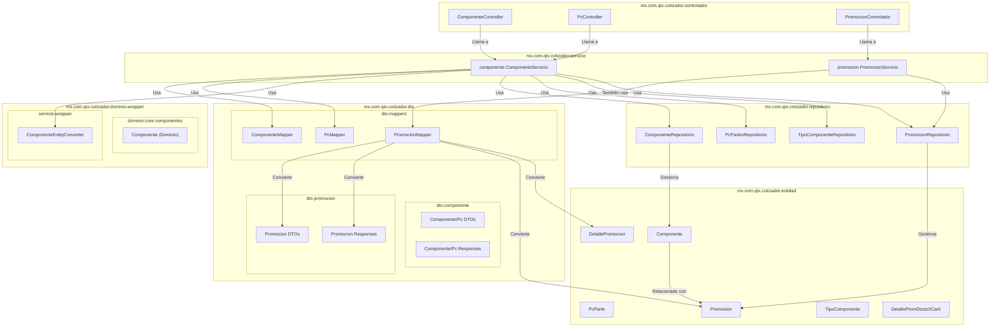
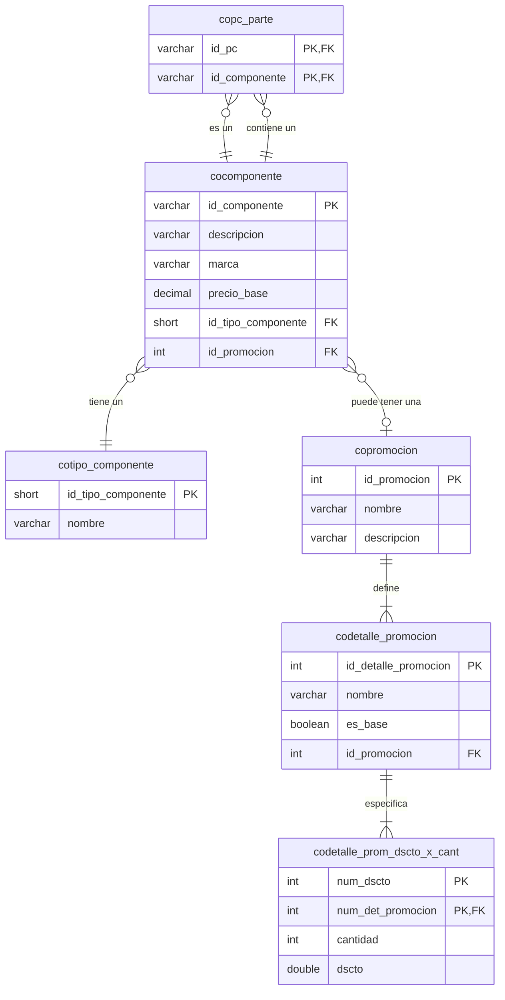

# Análisis de Dependencias Completo (Componentes, PCs y Promociones)

Este documento detalla todas las clases y tablas de base de datos necesarias para soportar la funcionalidad expuesta en `ComponenteController`, `PcController` y `PromocionControlador`. Esta versión final refleja la arquitectura completa con sus múltiples verticales de negocio.

## 1. Diagrama de Dependencias de Clases (Arquitectura Completa)

Este diagrama muestra dos flujos de aplicación distintos: uno para la gestión de Catálogo (Componentes y PCs) y otro para la gestión de Promociones. Ambos flujos son independientes a nivel de controlador y servicio, pero se relacionan en la capa de persistencia.

### Flujo de la Arquitectura (Análisis Final):

Existen dos verticales de negocio claras:

1.  **Gestión de Catálogo (Componentes/PCs):** Iniciado por `ComponenteController` y `PcController`, orquestado por `ComponenteServicio`. Este servicio es complejo, ya que no solo gestiona componentes, sino que también *consulta* el `PromocionRepositorio` para asignar promociones existentes a los componentes.
2.  **Gestión de Promociones:** Iniciado por `PromocionControlador` y orquestado por `PromocionServicio`. Este servicio se enfoca exclusivamente en el ciclo de vida CRUD de las promociones y sus detalles.

El punto clave de acoplamiento entre estas dos verticales no ocurre a nivel de servicio, sino en la **capa de persistencia**: la entidad `Componente` tiene una clave foránea a la entidad `Promocion`.

---

## 2. Diagrama de Entidad-Relación (Capa de Datos)

Este diagrama es el mismo que en la versión anterior, ya que el análisis profundo de las entidades ya había revelado la estructura completa. Ahora se entiende mejor cómo las dos verticales de la aplicación operan sobre este esquema.

## Conclusión Final

Para extraer un microservicio de **Gestión de Catálogo**, se necesitarían las clases del primer flujo. Sin embargo, este nuevo microservicio seguiría dependiendo de los datos de promociones.

La estrategia de separación ideal sería:

1.  **Crear un `ms-catalogo`:** Migrar toda la vertical de `ComponenteController`, `PcController` y `ComponenteServicio` con sus dependencias.
2.  **Crear un `ms-promociones`:** Migrar toda la vertical de `PromocionControlador` y `PromocionServicio`.
3.  **Romper el Acoplamiento:** En lugar de que `ms-catalogo` acceda directamente a la tabla de promociones, la asignación se haría de forma desacoplada:
    *   `ms-catalogo` podría consultar a `ms-promociones` a través de una API REST para obtener una lista de promociones válidas.
    *   La entidad `Componente` en `ms-catalogo` ya no tendría una relación JPA directa, sino que simplemente almacenaría un `id_promocion`.
    *   La validación de que ese ID es correcto se haría mediante comunicación entre servicios.