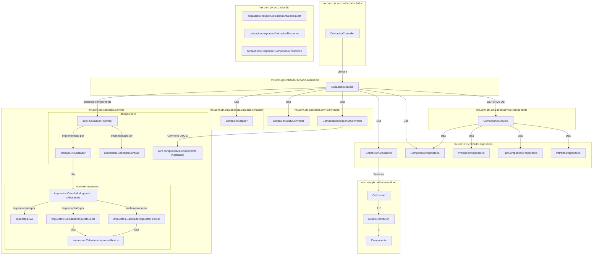
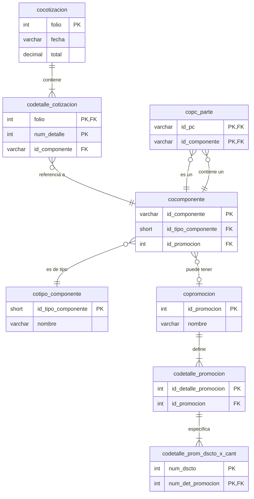

# Análisis de Dependencias para el Módulo de Cotizaciones (Versión Final con Máximo Detalle)

Este documento detalla **todas** las clases y tablas de base de datos, incluyendo dependencias directas, transitivas y las implementaciones concretas de la capa de dominio, necesarias para soportar la funcionalidad expuesta en `CotizacionController`.

## 1. Diagrama de Dependencias de Clases (Nivel Máximo de Detalle)

Este diagrama desglosa todos los componentes, incluyendo las implementaciones específicas de los patrones de diseño en la capa de dominio, y ubica cada clase en su paquete real para ofrecer una visión completa y sin abstracciones.

### Flujo de la Arquitectura (Análisis Detallado):

El `CotizacionServicio` es el núcleo de la orquestación y su complejidad radica en cómo construye y utiliza la capa de dominio:
1.  **Selección de Estrategia de Cotizador:** El servicio actúa como una *Factory*. Basado en un parámetro del DTO, instancia una implementación concreta de `ICotizador` (sea `cotizadorA.Cotizador` o `cotizadorB.CotizadorConMap`).
2.  **Selección de Estrategia de Impuestos:** De manera similar, instancia las implementaciones concretas de `CalculadorImpuesto` (`IVA`, `CalculadorImpuestoLocal`, etc.) que serán inyectadas en la estrategia de cotizador.
3.  **Conversión de Datos:** Llama al `ComponenteServicio` para obtener DTOs, que luego convierte a objetos de dominio `Componente` para poder pasarlos a la estrategia de cotizador.

---

## 2. Diagrama de Entidad-Relación (Esquema Completo Requerido)

Este diagrama no cambia, ya que el análisis de la capa de datos ya era exhaustivo.

## Conclusión Definitiva

La funcionalidad del `CotizacionController` está **fuertemente acoplada** a la funcionalidad del `ComponenteController`. Para que las cotizaciones funcionen, se necesita prácticamente todo el subdominio de Catálogo. La lista completa de clases y repositorios necesarios es la siguiente:

*   **Servicios:** `CotizacionServicio`, `ComponenteServicio`.
*   **Repositorios:** `CotizacionRepositorio`, `ComponenteRepositorio`, `PromocionRepositorio`, `TipoComponenteRepositorio`, `PcPartesRepositorio`.
*   **Entidades:** `Cotizacion`, `DetalleCotizacion`, `Componente`, `Promocion` (con sus detalles), `TipoComponente`, `PcParte`.
*   **Toda la lógica de Dominio, DTOs, Mappers y Converters** asociados a ambos módulos.