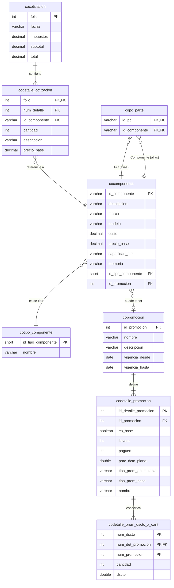

# Análisis de Dependencias para el Módulo de Cotizaciones (Versión Final con Máximo Detalle)

Este documento detalla **todas** las clases y tablas de base de datos, incluyendo dependencias directas, transitivas y las implementaciones concretas de la capa de dominio, necesarias para soportar la funcionalidad expuesta en `CotizacionController`.

## 1. Diagrama de Dependencias de Clases (Nivel Máximo de Detalle)

Este diagrama desglosa todos los componentes, incluyendo las implementaciones específicas de los patrones de diseño en la capa de dominio, y ubica cada clase en su paquete real para ofrecer una visión completa y sin abstracciones.

```mermaid
graph TD
    %% Controlador
    subgraph "mx.com.qtx.cotizador.controlador"
        CC["CotizacionController"]
    end

    %% Servicios
    subgraph "mx.com.qtx.cotizador.servicio.cotizacion"
        CS["CotizacionServicio"]
    end
    subgraph "mx.com.qtx.cotizador.servicio.componente"
        CompServ["ComponenteServicio"]
    end

    %% DTOs y Mappers
    subgraph "mx.com.qtx.cotizador.dto"
        ReqCot["cotizacion.request.CotizacionCreateRequest"]
        RespCot["cotizacion.response.CotizacionResponse"]
        RespComp["componente.response.ComponenteResponse"]
    end
    subgraph "mx.com.qtx.cotizador.dto.cotizacion.mapper"
        CotMap["CotizacionMapper"]
    end

    %% Wrappers/Converters
    subgraph "mx.com.qtx.cotizador.servicio.wrapper"
        CotEntConv["CotizacionEntityConverter"]
        CompRespConv["ComponenteResponseConverter"]
        CompEntConv["ComponenteEntityConverter"]
        PromEntConv["PromocionEntityConverter"]
    end

    %% Dominio
    subgraph "mx.com.qtx.cotizador.dominio"
        direction LR
        subgraph "dominio.core"
            ICotizador["core.ICotizador (Interfaz)"]
            CotizadorA["cotizadorA.Cotizador"]
            CotizadorB["cotizadorB.CotizadorConMap"]
            CompDom["core.componentes.Componente (Abstracto)"]
            IPromocion["core.componentes.IPromocion (Interfaz)"]
            CompSimple["core.componentes.ComponenteSimple"]
            Monitor["core.componentes.Monitor"]
            DiscoDuro["core.componentes.DiscoDuro"]
            TarjetaVideo["core.componentes.TarjetaVideo"]
            Pc["core.componentes.Pc"]
            PcBuilder["core.componentes.PcBuilder"]
        end
        subgraph "dominio.impuestos"
            CalcImp["impuestos.CalculadorImpuesto (Abstracto)"]
            IVA["impuestos.IVA"]
            CalcImpLocal["impuestos.CalculadorImpuestoLocal"]
            CalcImpFed["impuestos.CalculadorImpuestoFederal"]
            CalcImpMex["impuestos.CalculadorImpuestoMexico"]
        end
        subgraph "dominio.promos"
            PromAbs["promos.Promocion (Abstracta)\nimplements IPromocion"]
            PromBase["promos.PromBase"]
            PromAcum["promos.PromAcumulable"]
            PromNXM["promos.PromNXM"]
            PromPlano["promos.PromDsctoPlano"]
            PromXCant["promos.PromDsctoXcantidad"]
            PromNone["promos.PromSinDescto"]
            PromBuilder["promos.PromocionBuilder"]
        end
    end

    %% Repositorios
    subgraph "mx.com.qtx.cotizador.repositorio"
        CotRepo["CotizacionRepositorio"]
        CompRepo["ComponenteRepositorio"]
        PromoRepo["PromocionRepositorio"]
        TipoCompRepo["TipoComponenteRepositorio"]
        PcPartesRepo["PcPartesRepositorio"]
    end

    %% Entidades
    subgraph "mx.com.qtx.cotizador.entidad"
        CotEnt["Cotizacion"]
        DetCotEnt["DetalleCotizacion"]
        CompEnt["Componente"]
        PromoEnt["Promocion"]
        DetPromoEnt["DetallePromocion"]
        DetPromoCantEnt["DetallePromDsctoXCant"]
    end

    %% Relaciones principales
    CC --> CS
    CS -->|usa| CompServ
    CS -->|usa| CotRepo
    CS -->|usa| CotMap
    CS -->|usa| CotEntConv
    CS -->|convierte DTO→dominio| CompRespConv
    CS -->|instancia| ICotizador

    ICotizador --> CotizadorA
    ICotizador --> CotizadorB
    CotizadorA --> CalcImp
    CalcImp --> IVA
    CalcImp --> CalcImpLocal
    CalcImp --> CalcImpFed
    CalcImpLocal --> CalcImpMex
    CalcImpFed --> CalcImpMex

    %% Promos por interfaz
    CompDom -->|tiene| IPromocion
    PromAbs -.implementa.-> IPromocion
    
    %% Jerarquía de componentes
    CompSimple -->|extiende| CompDom
    Monitor -->|extiende| CompSimple
    DiscoDuro -->|extiende| CompSimple
    TarjetaVideo -->|extiende| CompSimple
    Pc -->|extiende| CompDom
    PcBuilder -->|construye| Pc
    PromAbs --> PromBase
    PromAbs --> PromAcum
    PromBase --> PromNXM
    PromBase --> PromNone
    PromAcum --> PromPlano
    PromAcum --> PromXCant
    PromBuilder --> PromAbs

    %% Converters de componentes y promociones
    CompServ -->|usa| CompRepo
    CompServ -->|usa| PromoRepo
    CompServ -->|usa| TipoCompRepo
    CompServ -->|usa| PcPartesRepo
    CompServ -->|usa| CompEntConv
    CompEntConv -->|usa| PromEntConv
    PromEntConv -->|convierte| PromoEnt

    %% Entidades y repos
    CotRepo --> CotEnt
    CotEnt -->|1..*| DetCotEnt
    DetCotEnt -->|1| CompEnt
    CompEnt -->|0..1| PromoEnt
    PromoEnt -->|1..*| DetPromoEnt
    DetPromoEnt -->|0..*| DetPromoCantEnt
```

### Flujo de la Arquitectura (Análisis Detallado):

El `CotizacionServicio` es el núcleo de la orquestación y su complejidad radica en cómo construye y utiliza la capa de dominio:
1.  **Selección de Estrategia de Cotizador:** El servicio actúa como una *Factory*. Basado en un parámetro del DTO, instancia una implementación concreta de `ICotizador` (sea `cotizadorA.Cotizador` o `cotizadorB.CotizadorConMap`).
2.  **Selección de Estrategia de Impuestos:** De manera similar, instancia las implementaciones concretas de `CalculadorImpuesto` (`IVA`, `CalculadorImpuestoLocal`, etc.) que serán inyectadas en la estrategia de cotizador.
3.  **Conversión de Datos:** Llama al `ComponenteServicio` para obtener DTOs, que luego convierte a objetos de dominio `Componente` para poder pasarlos a la estrategia de cotizador.

---

## 2. Diagrama de Entidad-Relación (Esquema Completo Requerido)

Este diagrama no cambia, ya que el análisis de la capa de datos ya era exhaustivo.

## Conclusión Definitiva

La funcionalidad del `CotizacionController` está **fuertemente acoplada** a la funcionalidad del `ComponenteController`. Para que las cotizaciones funcionen, se necesita prácticamente todo el subdominio de Catálogo y el subsistema de promociones aplicado vía interfaz (`IPromocion`). La lista completa de clases y repositorios necesarios es la siguiente (actualizada):

*   **Servicios:** `CotizacionServicio`, `ComponenteServicio`.
*   **Repositorios:** `CotizacionRepositorio`, `ComponenteRepositorio`, `PromocionRepositorio`, `TipoComponenteRepositorio`, `PcPartesRepositorio`.
*   **Entidades:** `Cotizacion`, `DetalleCotizacion`, `Componente`, `Promocion` (con `DetallePromocion` y `DetallePromDsctoXCant`), `TipoComponente`, `PcParte`.
*   **Dominio (cotización y componentes):** `ICotizador`, `cotizadorA.Cotizador`, `cotizadorB.CotizadorConMap`, `core.componentes.Componente`.
*   **Dominio (promociones):** `core.componentes.IPromocion`, `promos.Promocion`, `PromBase`, `PromAcumulable`, `PromNXM`, `PromDsctoPlano`, `PromDsctoXcantidad`, `PromSinDescto`, `PromocionBuilder`.
*   **DTOs y Mappers:** `CotizacionCreateRequest`, `CotizacionResponse`, `ComponenteResponse`, `CotizacionMapper`.
*   **Wrappers/Converters:** `CotizacionEntityConverter`, `ComponenteResponseConverter`, `ComponenteEntityConverter`, `PromocionEntityConverter`.

Notas relevantes:
- Las promociones se aplican en el dominio a través de `IPromocion`, y son construidas desde la base de datos mediante `PromocionEntityConverter` cuando se convierte una `entidad.Componente` a `dominio.core.componentes.Componente`.
- Actualmente `ComponenteResponse` y `ComponenteResponseConverter` no transportan ni restauran la promoción; si se requiere que las promociones impacten el cálculo en `CotizacionServicio`, se recomienda exponer la promoción en el DTO o convertir directamente la entidad a dominio en el flujo de cotización.