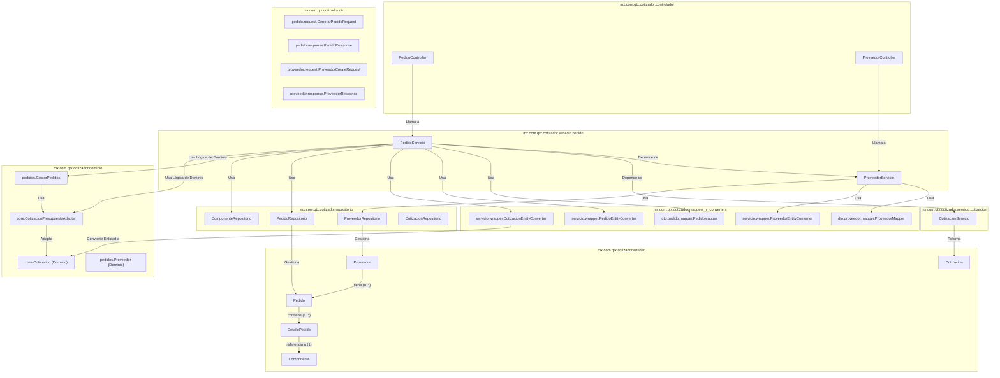
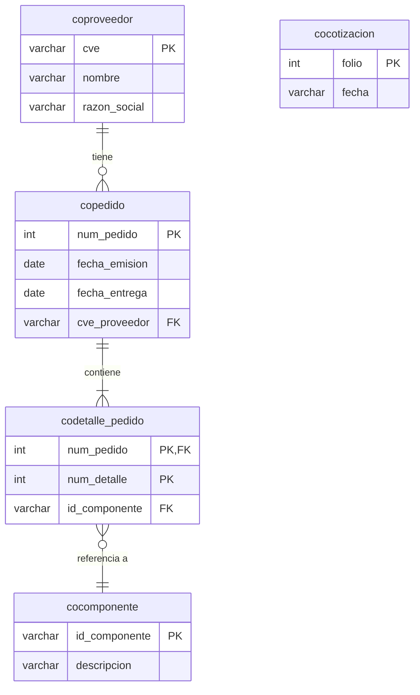

# Análisis Unificado de Dependencias para Módulos de Pedidos y Proveedores (Versión Final Detallada)

Este documento presenta un análisis consolidado y con el máximo nivel de detalle de las clases y tablas de base de datos necesarias para soportar la funcionalidad de `PedidoController` y `ProveedorController`.

## 1. Diagrama de Dependencias de Clases (Visión Unificada y Detallada)

Este diagrama desglosa cada clase involucrada para ofrecer una visión holística y precisa de las interacciones y dependencias entre ambos módulos.

### Flujo de la Arquitectura (Visión Unificada):

1.  **Vertical de Proveedores (Autocontenida):** El `ProveedorController` activa el `ProveedorServicio`, que realiza operaciones CRUD sobre la entidad `Proveedor` a través de su repositorio. Es un flujo simple y directo.
2.  **Vertical de Pedidos (Orquestadora):** El `PedidoController` activa el `PedidoServicio`. Este servicio es mucho más complejo, ya que para cumplir su función debe:
    *   **Llamar a otros servicios:** Se comunica con `ProveedorServicio` y `CotizacionServicio` para obtener y validar datos.
    *   **Utilizar la capa de Dominio:** Emplea el `GestorPedidos` y `Adapters` para aplicar la lógica de negocio.
    *   **Acceder a múltiples repositorios:** Interactúa con `PedidoRepositorio`, `ProveedorRepositorio` y `ComponenteRepositorio` para persistir la información.

---

## 2. Diagrama de Entidad-Relación (Visión Unificada)

Este diagrama ER consolida todas las tablas necesarias para ambos módulos, mostrando cómo `coproveedor` es una tabla central para esta área del dominio.

### Relaciones de la Base de Datos:

*   La tabla `coproveedor` es el punto de anclaje.
*   La tabla `copedido` depende directamente de `coproveedor`.
*   La tabla `codetalle_pedido` depende de `copedido` y `cocomponente`.
*   La lógica de negocio para crear un pedido depende implícitamente de que exista una `cocotizacion`.

## Conclusión Final

La visión unificada de los diagramas demuestra que, aunque existen dos controladores distintos, no hay dos verticales de negocio verdaderamente independientes. El módulo de **Proveedores** es un **subdominio de soporte**, mientras que el módulo de **Pedidos** es un **subdominio de orquestación** que consume al primero.

*   **Extraer `Proveedores`:** Es factible y relativamente sencillo. El nuevo `ms-proveedores` expondría una API que el `ms-pedidos` consumiría.
*   **Extraer `Pedidos`:** Es complejo. Requeriría que el nuevo `ms-pedidos` reemplazara sus llamadas directas a `CotizacionServicio` y `ProveedorServicio` por llamadas de API REST (o comunicación por eventos) a los otros dos microservicios.

La funcionalidad de Pedidos y Proveedores está intrínsecamente ligada, siendo la gestión de Proveedores una capacidad fundamental requerida por la gestión de Pedidos.
