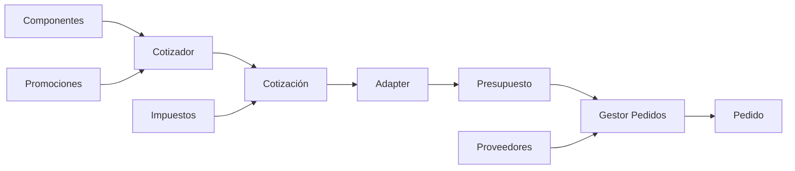

# 🖥️ Sistema Cotizador de PC Partes

Sistema empresarial para la cotización de componentes de hardware, generación de pedidos y gestión de inventario con arquitectura modular basada en patrones de diseño.

## 📋 Funcionalidades del Proyecto

### Funcionalidades Principales

- **Gestión de Componentes**: Administración completa de componentes de hardware (monitores, discos duros, tarjetas de video y PCs ensambladas)
- **Sistema de Cotizaciones**: Generación de cotizaciones detalladas con cálculo automático de totales e impuestos
- **Promociones Flexibles**: Aplicación de descuentos planos, por cantidad, ofertas N×M y promociones acumulables
- **Cálculo de Impuestos Multi-país**: Soporte para esquemas impositivos de México, USA y Canadá
- **Generación de Pedidos**: Conversión automática de cotizaciones a pedidos con asignación a proveedores
- **Persistencia Completa**: Almacenamiento en base de datos de todos los componentes, cotizaciones y pedidos

### Características Adicionales

- Generación de reportes detallados de cotizaciones
- Validación de reglas de negocio (ej: máximo 2 discos por PC)
- Manejo de excepciones personalizadas
- Arquitectura extensible para nuevos tipos de componentes

## ⚙️ Funcionamiento

### Descripción General del Sistema

El sistema funciona como un flujo integrado donde cada componente cumple un rol específico para lograr el objetivo principal: **generar cotizaciones precisas de componentes de PC y convertirlas en pedidos ejecutables**.

### Flujo de Trabajo del Sistema



### Interrelación de Componentes

1. **Catálogo de Componentes**
   - Los componentes (monitores, discos, tarjetas) se almacenan en la base de datos
   - Cada componente tiene precio base y puede tener promociones asociadas
   - Las PCs son componentes compuestos que agrupan otros componentes

2. **Proceso de Cotización**
   - El **Cotizador** actúa como agregador de componentes
   - Se seleccionan componentes y cantidades específicas
   - Las **Promociones** se aplican automáticamente durante el cálculo
   - El sistema calcula subtotales por línea

3. **Generación de Cotización**
   - La **Cotización** consolida todos los componentes seleccionados
   - Los **Impuestos** se calculan según el país configurado (Bridge Pattern)
   - Se genera un documento con desglose detallado y totales

4. **Conversión a Pedido**
   - El **Adapter** transforma la Cotización en un Presupuesto estándar
   - El **Gestor de Pedidos** procesa el presupuesto
   - Se asigna un **Proveedor** específico al pedido
   - Se establecen fechas de emisión y entrega

5. **Persistencia**
   - Todos los datos se almacenan usando **JPA/Hibernate**
   - Los **Servicios** encapsulan la lógica de negocio
   - Los **Repositorios** gestionan el acceso a datos

### Ejemplo de Flujo Completo

```java
// 1. SELECCIÓN: Usuario selecciona componentes
Componente monitor = buscarComponente("M001");
Componente disco = buscarComponente("D001");

// 2. COTIZACIÓN: Agregar al cotizador con cantidades
ICotizador cotizador = new Cotizador();
cotizador.agregarComponente(2, monitor);  // 2 monitores
cotizador.agregarComponente(5, disco);    // 5 discos

// 3. IMPUESTOS: Configurar esquema impositivo
List<CalculadorImpuesto> impuestos = configurarImpuestosMexico();

// 4. GENERACIÓN: Crear cotización con cálculos automáticos
Cotizacion cotizacion = cotizador.generarCotizacion(impuestos);
// - Aplica promociones si existen
// - Calcula subtotales
// - Aplica impuestos
// - Genera totales

// 5. PERSISTENCIA: Guardar en base de datos
cotizacion.guardarCotizacion();

// 6. CONVERSIÓN: Transformar a pedido
ManejadorCreacionPedidos manejador = new ManejadorCreacionPedidos();
manejador.crearPedidoDesdeCotizacion(
    cotizacion, 
    "PROV001",     // Proveedor
    1,             // Número pedido
    1,             // Nivel surtido
    LocalDate.now(), 
    LocalDate.now().plusDays(3)
);

// 7. RESULTADO: Pedido generado y almacenado
```

### Puntos Clave de la Arquitectura

- **Desacoplamiento**: Cada módulo tiene responsabilidades claras y definidas
- **Flexibilidad**: Los patrones de diseño permiten agregar nuevas funcionalidades sin modificar código existente
- **Escalabilidad**: La arquitectura en capas facilita el crecimiento del sistema
- **Mantenibilidad**: La separación de conceptos hace el código más fácil de mantener

## 🔧 Requisitos para Ejecutar

### Software Requerido

- **Java Development Kit (JDK)**: 21 o superior
- **MySQL**: 8.0 o superior
- **Maven**: 3.6+ (opcional si se usa el wrapper incluido)
- **Git**: Para clonar el repositorio

### Configuración de Base de Datos

1. Crear una base de datos MySQL llamada `cotizador`:
```sql
CREATE DATABASE cotizador CHARACTER SET utf8mb4 COLLATE utf8mb4_unicode_ci;
```

2. Crear un usuario con los permisos necesarios:
```sql
CREATE USER 'usuario'@'localhost' IDENTIFIED BY 'password';
GRANT ALL PRIVILEGES ON cotizador.* TO 'usuario'@'localhost';
FLUSH PRIVILEGES;
```

3. Ejecutar los scripts SQL incluidos en el proyecto:
```bash
mysql -u usuario -p cotizador < sql/ddl.sql
mysql -u usuario -p cotizador < sql/dml.sql
```

## 🏗️ Características Técnicas

### Arquitectura del Sistema

El proyecto implementa una arquitectura en capas con separación clara de responsabilidades:

```
┌─────────────────────────────────────────────────────┐
│                  Casos de Uso                       │
│         (CotizadorTest, AdapterBridgeTest)         │
├─────────────────────────────────────────────────────┤
│                   Servicios                         │
│    (ComponenteServicio, CotizacionServicio, etc)   │
├─────────────────────────────────────────────────────┤
│                 Core/Dominio                        │
│  (Componentes, Cotizaciones, Pedidos, Impuestos)   │
├─────────────────────────────────────────────────────┤
│                 Persistencia                        │
│      (Repositorios JPA, Entidades, Config)         │
└─────────────────────────────────────────────────────┘
```

### Tecnologías Utilizadas

- **Java 21**: Lenguaje de programación principal
- **Spring Framework 6.2.6**: 
  - Spring Context para IoC/DI
  - Spring Data JPA para persistencia
  - Spring TX para manejo de transacciones
- **Hibernate 6.6.14**: ORM para mapeo objeto-relacional
- **MySQL Connector 8.4.0**: Driver JDBC para MySQL
- **Maven**: Gestión de dependencias y construcción

### Patrones de Diseño Implementados

1. **Builder Pattern**: 
   - `PcBuilder`: Construcción fluida de PCs con validaciones
   - `PromocionBuilder`: Creación de promociones complejas

2. **Adapter Pattern**:
   - `CotizacionPresupuestoAdapter`: Convierte Cotizacion → IPresupuesto

3. **Bridge Pattern**:
   - Sistema de impuestos con separación abstracción/implementación
   - Permite combinar tipos de impuesto (local/federal) con países

4. **Composite Pattern**:
   - `Pc` como componente compuesto que contiene otros componentes

5. **Decorator Pattern**:
   - Sistema de promociones acumulables (`PromAcumulable`)

6. **Repository Pattern**:
   - Interfaces de repositorio para cada entidad principal

7. **Factory Method**:
   - Métodos estáticos en `Componente` para crear tipos específicos

### Estructura de Paquetes

```
mx.com.qtx.cotizadorv1ds/
├── casosDeUso/          # Clases principales de prueba
├── config/              # Configuración Spring y sistema
├── core/                # Clases del dominio principal
│   └── componentes/     # Tipos de componentes
├── cotizadorA/          # Implementación estándar del cotizador
├── cotizadorB/          # Implementación alternativa con Map
├── impuestos/           # Sistema de cálculo de impuestos
├── pedidos/             # Gestión de pedidos y proveedores
├── persistencia/        # Capa de acceso a datos
│   ├── config/          # Configuración JPA
│   ├── entidades/       # Entidades JPA
│   └── repositorios/    # Interfaces Repository
├── promos/              # Sistema de promociones
└── servicios/           # Servicios de negocio
    └── wrapper/         # Conversores entidad-dominio
```

## 🚀 Ejecución Local

### 1. Clonar el Repositorio

```bash
git clone https://github.com/usuario/CotizadorPcPartes.git
cd CotizadorPcPartes
```

### 2. Configurar la Base de Datos

Editar el archivo `src/main/resources/application.properties`:

```properties
# Ajustar según tu configuración local
db.url=jdbc:mysql://localhost:3306/cotizador?serverTimezone=UTC&allowPublicKeyRetrieval=true&useSSL=false
db.username=usuario
db.password=password
```

### 3. Compilar el Proyecto

```bash
mvn clean compile
```

### 4. Ejecutar la Aplicación

Opción 1 - Ejecutar el caso de prueba principal:
```bash
mvn exec:java -Dexec.mainClass="mx.com.qtx.cotizadorv1ds.casosDeUso.CotizadorTest"
```

Opción 2 - Ejecutar el test de integración Adapter-Bridge:
```bash
mvn exec:java -Dexec.mainClass="mx.com.qtx.cotizadorv1ds.casosDeUso.CotizacionAdapterBridgeTest"
```

Opción 3 - Generar JAR ejecutable:
```bash
mvn clean package
java -jar target/m02ejm01_CotizadorV1ds-2.0.0.jar
```

## 🧪 Ejecución de Pruebas

### Pruebas Unitarias de Repositorios

```bash
# Ejecutar todas las pruebas
mvn test

# Ejecutar una prueba específica
mvn test -Dtest=ComponenteRepositoryTest
mvn test -Dtest=CotizacionRepositoryTest
mvn test -Dtest=PedidoRepositoryTest
```

### Casos de Prueba Principales

1. **CotizadorTest**: Prueba completa del flujo de cotización
   - Creación de componentes
   - Construcción de PCs
   - Generación de cotizaciones con impuestos
   - Persistencia en base de datos

2. **CotizacionAdapterBridgeTest**: Prueba de integración de patrones
   - Conversión cotización → presupuesto (Adapter)
   - Aplicación de impuestos multi-país (Bridge)
   - Generación de pedidos múltiples

3. **PromocionTest**: Prueba del sistema de promociones
   - Descuentos simples y acumulables
   - Validación de cálculos

### Verificar Resultados

Los resultados de las pruebas se mostrarán en la consola con formato detallado:

```
================== Cotizacion número:1 del 2024-12-07 ==================
  3 Categoría:MONITOR             Monitor 17 pulgadas  con precio base de $ 2000.00 cuesta(n)  6000.00
  4 Categoría:TARJETA DE VIDEO    Tarjeta THOR         con precio base de $  300.00 cuesta(n)  1200.00
                                                                   Subtotal:$ 7200.00
                                                                  Impuestos:$ 1152.00
                                                                      Total:$ 8352.00
```

## 📊 Ejemplo de Uso

```java
// Crear componentes
Componente monitor = Componente.crearMonitor("M001", "Monitor 27 pulgadas", 
    "LG", "27UL550", new BigDecimal(3000), new BigDecimal(5000));
monitor.guardarComponente();

// Crear cotizador y agregar componentes
ICotizador cotizador = new Cotizador();
cotizador.agregarComponente(2, monitor);

// Generar cotización con impuestos de México
List<CalculadorImpuesto> impuestos = List.of(
    new CalculadorImpuestoFederal(new CalculadorImpuestoMexico())
);
Cotizacion cotizacion = cotizador.generarCotizacion(impuestos);

// Guardar y mostrar
cotizacion.guardarCotizacion();
cotizacion.emitirComoReporte();
```

## 📝 Notas Adicionales

- El sistema valida automáticamente las reglas de negocio (ej: máximo 2 discos por PC)
- Los IDs de componentes deben ser únicos en el sistema
- Las promociones se pueden encadenar para crear descuentos complejos
- La configuración de impuestos es flexible y extensible a nuevos países

## 🤝 Contribuciones

Para contribuir al proyecto:

1. Fork el repositorio
2. Crea una rama para tu feature (`git checkout -b feature/AmazingFeature`)
3. Commit tus cambios (`git commit -m 'Add some AmazingFeature'`)
4. Push a la rama (`git push origin feature/AmazingFeature`)
5. Abre un Pull Request

## 📄 Licencia

Este proyecto está licenciado bajo la Licencia MIT - ver el archivo [LICENSE](LICENSE) para más detalles.