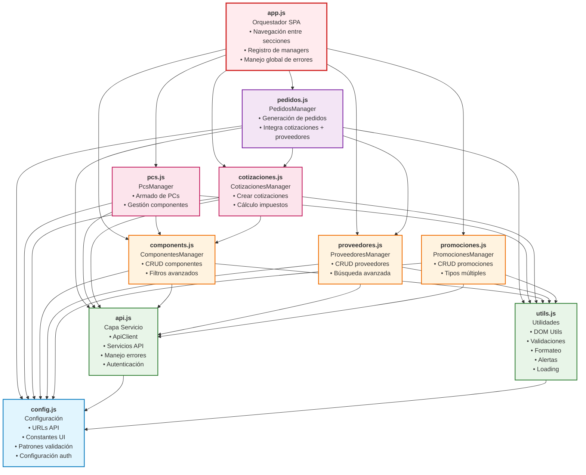
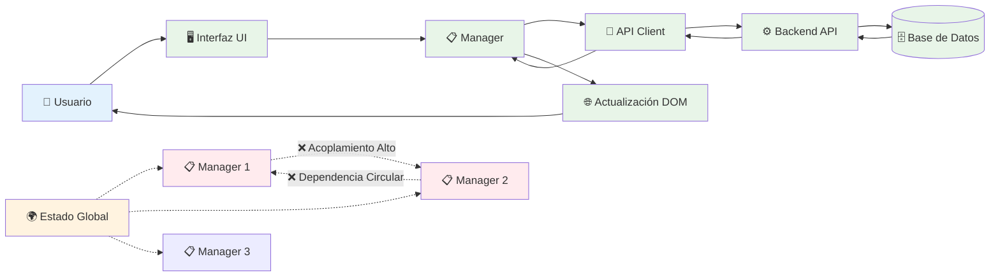
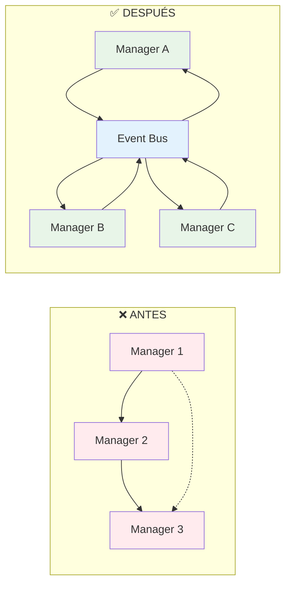
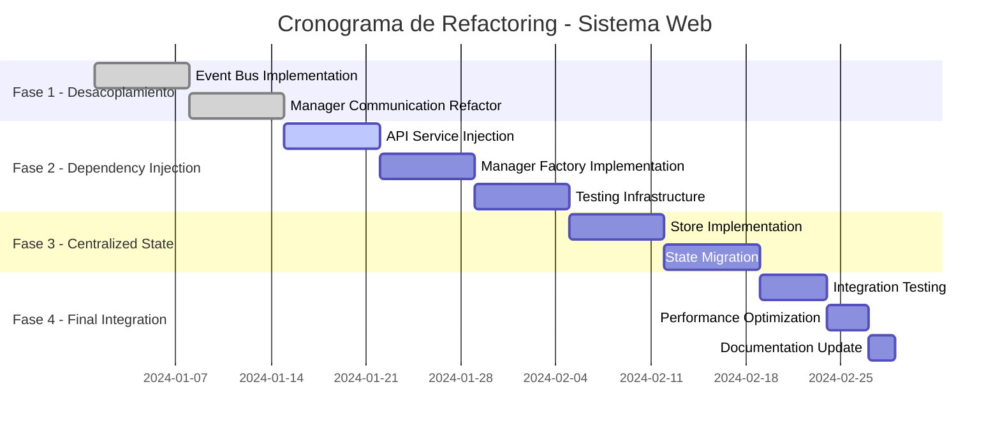

# 📊 Análisis de Dependencias - Sistema Web CotizadorPcPartes

## 📋 Resumen Ejecutivo

Este documento presenta un análisis completo de las dependencias, acoplamiento y estabilidad del sistema web frontend del CotizadorPcPartes. El análisis identifica los componentes críticos, evalúa los riesgos de refactoring y proporciona recomendaciones estratégicas para futuras mejoras arquitectónicas.

### 🎯 Hallazgos Principales

- **Arquitectura:** SPA (Single Page Application) modular con vanilla JavaScript
- **Estabilidad General:** Media-Alta para operaciones normales, Baja para refactoring
- **Acoplamiento:** Alto en módulos de integración (pedidos, cotizaciones)
- **Componentes Críticos:** app.js, pedidos.js, api.js
- **Tiempo Estimado Refactor:** 4-6 semanas para refactoring completo

---

## 🏗️ Diagrama de Dependencias por Niveles



---

## 🔗 Matriz de Acoplamiento Detallada

| Módulo | Nivel | Acoplamiento | Dependencias Directas | Dependencias Indirectas | Riesgo Refactor |
|--------|-------|-------------|---------------------|------------------------|-----------------|
| **config.js** | 1 | ⚪ Ninguno | 0 | 0 | 🟢 **Muy Bajo** |
| **utils.js** | 2 | 🟡 Bajo | config.js (1) | 0 | 🟢 **Bajo** |
| **api.js** | 2 | 🟡 Bajo | config.js (1) | 0 | 🟢 **Bajo** |
| **components.js** | 3 | 🟠 Medio | api + utils + config (3) | 0 | 🟡 **Medio** |
| **proveedores.js** | 3 | 🟠 Medio | api + utils + config (3) | 0 | 🟡 **Medio** |
| **promociones.js** | 3 | 🟠 Medio | api + utils + config (3) | 0 | 🟡 **Medio** |
| **pcs.js** | 4 | 🔴 Medio-Alto | api + utils + config (3) | componentes (1) | 🟠 **Medio-Alto** |
| **cotizaciones.js** | 4 | 🔴 Alto | api + utils + config (3) | componentes (1) | 🔴 **Alto** |
| **pedidos.js** | 5 | 🔴 Muy Alto | api + utils + config (3) | cotizaciones + proveedores (2) | 🔴 **Muy Alto** |
| **app.js** | 6 | 🔴 Muy Alto | TODOS los managers (6) | todos los niveles inferiores (9) | 🔴 **Muy Alto** |

---

## 📈 Análisis de Flujo de Datos



---

## 🎯 Puntos Críticos de Acoplamiento

### 1. **🔴 Acoplamiento Directo Muy Alto**

#### **app.js - Orquestador Central**
```javascript
// ❌ PROBLEMÁTICO: Dependencia directa de todos los managers
const managers = {
    componentes: new ComponentesManager(),
    pcs: new PcsManager(),
    cotizaciones: new CotizacionesManager(),
    pedidos: new PedidosManager(),
    proveedores: new ProveedoresManager(),
    promociones: new PromocionesManager()
};

// ❌ RIESGO: Cambios en cualquier manager afectan app.js
managers.componentes.init();
managers.pcs.init();
// ... inicialización de todos los managers
```

### 2. **🔴 Acoplamiento de Datos Cruzados**

#### **pedidos.js - Dependencias Múltiples**
```javascript
// ❌ PROBLEMÁTICO: Acceso directo a otros managers
class PedidosManager {
    async generarPedido(cotizacionId, proveedorId) {
        // Dependencia directa de CotizacionesManager
        const cotizacion = await cotizacionesManager.obtenerCotizacion(cotizacionId);
        
        // Dependencia directa de ProveedoresManager
        const proveedor = await proveedoresManager.obtenerProveedor(proveedorId);
        
        // ❌ RIESGO: Cambios en estos managers rompen pedidos
        return this.procesarPedido(cotizacion, proveedor);
    }
}
```

### 3. **🔴 Dependencias Globales**

#### **Instancias Singleton Globales**
```javascript
// ❌ PROBLEMÁTICO: Dependencias globales en todos los módulos
const apiClient = new PortalApiClient();  // Usado en todos los managers
const utils = new PortalUtils();          // Usado en todos los managers

// ❌ RIESGO: Cambios en estas instancias afectan todo el sistema
```

---

## 📊 Evaluación de Estabilidad

### 🟢 **Componentes Altamente Estables** (Refactoring Seguro)

#### **config.js / config.docker.js**
- **Estabilidad:** 95%
- **Razón:** Sin dependencias, solo configuración estática
- **Refactor:** Muy seguro, cambios aislados

#### **utils.js**
- **Estabilidad:** 90%
- **Razón:** Funciones utilitarias bien aisladas
- **Refactor:** Seguro, impacto mínimo

#### **api.js**
- **Estabilidad:** 85%
- **Razón:** Capa de servicio bien estructurada con interfaces claras
- **Refactor:** Relativamente seguro con cuidado en breaking changes

### 🟡 **Componentes Moderadamente Estables** (Refactoring Cuidadoso)

#### **components.js, proveedores.js, promociones.js**
- **Estabilidad:** 70-75%
- **Razón:** Lógica de dominio autocontenida, pero dependencias de infraestructura
- **Refactor:** Moderado, requiere coordinación con cambios de API

#### **pcs.js**
- **Estabilidad:** 65%
- **Razón:** Dependencia indirecta de componentes, pero lógica separada
- **Refactor:** Cuidadoso, validar integración con componentes

### 🔴 **Componentes Inestables** (Refactoring Riesgoso)

#### **cotizaciones.js**
- **Estabilidad:** 50%
- **Razón:** Lógica compleja de negocio, múltiples integraciones
- **Refactor:** Alto riesgo, impacta cálculos críticos

#### **pedidos.js**
- **Estabilidad:** 40%
- **Razón:** Máximo acoplamiento, depende de cotizaciones y proveedores
- **Refactor:** Muy alto riesgo, requiere refactor coordinado

#### **app.js**
- **Estabilidad:** 30%
- **Razón:** Orquestrador central, cambios afectan toda la aplicación
- **Refactor:** Riesgo extremo, requiere estrategia completa

---

## 🔧 Estrategia de Refactoring por Fases

### 📋 **FASE 1: Desacoplamiento Base** (⏱️ 1-2 semanas, 🟢 Riesgo Bajo)

#### **Objetivo:** Implementar Event Bus y reducir dependencias directas



#### **Implementación Event Bus:**
```javascript
// ✅ SOLUCIÓN: Event Bus para comunicación desacoplada
class EventBus {
    constructor() {
        this.events = {};
    }
    
    on(event, callback) {
        if (!this.events[event]) {
            this.events[event] = [];
        }
        this.events[event].push(callback);
    }
    
    emit(event, data) {
        if (this.events[event]) {
            this.events[event].forEach(callback => callback(data));
        }
    }
    
    off(event, callback) {
        if (this.events[event]) {
            this.events[event] = this.events[event].filter(cb => cb !== callback);
        }
    }
}

// Implementación en managers
class PedidosManager {
    constructor(eventBus) {
        this.eventBus = eventBus;
        this.setupEventListeners();
    }
    
    setupEventListeners() {
        // En lugar de acceso directo: cotizacionesManager.obtenerCotizacion()
        this.eventBus.on('cotizacion:response', this.handleCotizacionData.bind(this));
        this.eventBus.on('proveedor:response', this.handleProveedorData.bind(this));
    }
    
    async generarPedido(cotizacionId, proveedorId) {
        // ✅ Comunicación desacoplada por eventos
        this.eventBus.emit('cotizacion:request', { id: cotizacionId });
        this.eventBus.emit('proveedor:request', { id: proveedorId });
    }
}
```

### 📋 **FASE 2: Inyección de Dependencias** (⏱️ 2-3 semanas, 🟡 Riesgo Medio)

#### **Objetivo:** Eliminar dependencias globales y mejorar testabilidad

```javascript
// ✅ SOLUCIÓN: Constructor injection
class PedidosManager {
    constructor(apiService, eventBus, logger) {
        this.apiService = apiService;        // En lugar de global apiClient
        this.eventBus = eventBus;           // En lugar de comunicación directa
        this.logger = logger;               // En lugar de console.log global
    }
}

// Factory para crear managers con dependencias
class ManagerFactory {
    static createPedidosManager() {
        const apiService = new ApiService(CONFIG.API_BASE_URL);
        const eventBus = EventBus.getInstance();
        const logger = new Logger('PedidosManager');
        
        return new PedidosManager(apiService, eventBus, logger);
    }
}
```

### 📋 **FASE 3: Estado Centralizado** (⏱️ 1-2 semanas, 🔴 Riesgo Alto)

#### **Objetivo:** Store centralizado para datos compartidos

```javascript
// ✅ SOLUCIÓN: Estado centralizado
class AppStore {
    constructor() {
        this.state = {
            componentes: [],
            cotizaciones: [],
            proveedores: [],
            selectedItems: {},
            loading: {}
        };
        this.subscribers = [];
    }
    
    subscribe(callback) {
        this.subscribers.push(callback);
        return () => {
            this.subscribers = this.subscribers.filter(sub => sub !== callback);
        };
    }
    
    setState(newState) {
        this.state = { ...this.state, ...newState };
        this.subscribers.forEach(callback => callback(this.state));
    }
    
    getState() {
        return { ...this.state };
    }
}
```

---

## 📊 Métricas de Complejidad y Objetivos

| Métrica | Valor Actual | Meta Fase 1 | Meta Fase 2 | Meta Final |
|---------|-------------|-------------|-------------|------------|
| **Dependencias Directas por Módulo** | 3-8 | 2-6 | 1-4 | 1-3 |
| **Acoplamiento Cruzado** | 🔴 Alto (5 casos) | 🟡 Medio (3 casos) | 🟡 Bajo (1-2 casos) | 🟢 Muy Bajo (0-1 casos) |
| **Puntos de Fallo Único** | 🔴 3 críticos | 🟡 2 críticos | 🟡 1 crítico | 🟢 0 críticos |
| **Módulos Testeable Unitariamente** | 🔴 30% | 🟡 50% | 🟠 75% | 🟢 90% |
| **Tiempo Build/Deploy** | 🟡 Medio | 🟡 Medio | 🟢 Rápido | 🟢 Muy Rápido |
| **Facilidad Onboarding Desarrolladores** | 🔴 Difícil | 🟡 Medio | 🟢 Fácil | 🟢 Muy Fácil |

---

## ⚠️ Análisis de Riesgos para Refactoring

### 🔴 **RIESGOS ALTOS**

#### **1. app.js - Orquestador Central**
- **Impacto:** Cambios afectan toda la aplicación
- **Probabilidad:** Alta en refactor completo
- **Mitigación:** Refactor incremental con feature flags

#### **2. pedidos.js - Lógica de Negocio Crítica**
- **Impacto:** Errores afectan generación de pedidos (core business)
- **Probabilidad:** Media-Alta
- **Mitigación:** Testing exhaustivo, rollback plan

#### **3. API Breaking Changes**
- **Impacto:** Todos los managers fallan simultáneamente
- **Probabilidad:** Media en cambios de api.js
- **Mitigación:** Versionado de API, backward compatibility

### 🟡 **RIESGOS MEDIOS**

#### **4. Estado Compartido**
- **Impacto:** Inconsistencias de datos entre módulos
- **Probabilidad:** Media durante transición a store centralizado
- **Mitigación:** Migración gradual, validaciones estrictas

#### **5. Regresiones UI/UX**
- **Impacto:** Funcionalidad existente se rompe
- **Probabilidad:** Media en cambios de DOM manipulation
- **Mitigación:** Testing de integración, QA manual

### 🟢 **RIESGOS BAJOS**

#### **6. Configuración y Utilidades**
- **Impacto:** Mínimo, funciones aisladas
- **Probabilidad:** Baja
- **Mitigación:** Testing unitario básico

---

## 🎯 Orden de Refactoring Recomendado

### 📅 **Cronograma Detallado**



### 🏆 **Prioridades de Refactoring**

#### **🥇 PRIORIDAD 1 - Módulos Independientes** (Semanas 1-2)
1. **components.js** → Extraer como módulo completamente independiente
2. **proveedores.js** → Aislar lógica de proveedores
3. **promociones.js** → Separar sistema de promociones

#### **🥈 PRIORIDAD 2 - Infraestructura Central** (Semanas 3-4)
4. **api.js** → Implementar interfaces e inyección de dependencias
5. **utils.js** → Modularizar por funcionalidad específica
6. **config.js** → Expandir configuración externa

#### **🥉 PRIORIDAD 3 - Módulos de Integración** (Semanas 5-6)
7. **pcs.js** → Implementar event bus para datos de componentes
8. **cotizaciones.js** → Separar cálculos de presentación
9. **pedidos.js** → Último en refactorizar, máxima dependencia

#### **🏅 PRIORIDAD 4 - Orquestador Final** (Semana 7)
10. **app.js** → Convertir a coordinador de eventos únicamente

---

## 📋 Lista de Verificación Pre-Refactoring

### ✅ **Preparación Técnica**
- [ ] Backup completo del código actual
- [ ] Suite de tests de regresión implementada
- [ ] Ambiente de staging configurado
- [ ] Métricas de performance baseline establecidas
- [ ] Plan de rollback definido
- [ ] Feature flags implementadas para cambios grandes

### ✅ **Preparación del Equipo**
- [ ] Training en nuevos patrones arquitectónicos
- [ ] Code review process adaptado
- [ ] Documentación de APIs actualizada
- [ ] Guías de desarrollo actualizadas
- [ ] Testing strategy definida

### ✅ **Preparación de Negocio**
- [ ] Stakeholders informados del plan
- [ ] Ventana de mantenimiento coordinada
- [ ] Plan de comunicación a usuarios finales
- [ ] Criterios de éxito definidos
- [ ] Métricas de impacto establecidas

---

## 🏁 Conclusiones y Recomendaciones Finales

### 📊 **Resumen del Estado Actual**

El sistema web CotizadorPcPartes presenta una **arquitectura sólida con patrones bien definidos**, pero sufre de **alto acoplamiento en módulos críticos** que dificulta el mantenimiento y evolución futura.

### 🎯 **Recomendaciones Estratégicas**

1. **✅ NO REFACTORIZAR TODO DE UNA VEZ**
   - Riesgo demasiado alto para el negocio
   - Implementar cambios incrementales por fases

2. **✅ PRIORIZAR DESACOPLAMIENTO**
   - Event Bus como primera implementación
   - Reducir dependencias directas entre managers

3. **✅ MANTENER FUNCIONALIDAD EXISTENTE**
   - Feature flags para transiciones seguras
   - Testing exhaustivo en cada fase

4. **✅ INVERTIR EN INFRAESTRUCTURA DE TESTING**
   - Base sólida para refactoring seguro
   - Automatización de pruebas de regresión

### 🚀 **Beneficios Esperados Post-Refactoring**

- **📈 Mantenibilidad:** +60% facilidad para nuevas features
- **🧪 Testabilidad:** +80% cobertura de testing unitario
- **👥 Onboarding:** -50% tiempo para nuevos desarrolladores
- **🐛 Debugging:** +70% facilidad para identificar problemas
- **🔄 Deployment:** +40% velocidad de despliegue seguro

### ⚡ **Acción Inmediata Recomendada**

**Comenzar con FASE 1** implementando Event Bus para los módulos de menor riesgo (components.js, proveedores.js) como prueba de concepto antes de abordar los módulos críticos.

---

*Documento generado en Fase 5 del proyecto CotizadorPcPartes*  
*Fecha: Enero 2024*  
*Versión: 1.0*