# 🔗 Integración Frontend-Backend APIs - Portal Cotizador

## 📋 Resumen Ejecutivo

Este documento analiza exhaustivamente cómo la aplicación web **portal-cotizador** consume los endpoints del backend **Cotizador** (Spring Boot). El análisis incluye patrones de comunicación, flujos de datos, manejo de errores y arquitectura de integración.

### 🎯 Hallazgos Principales

- **Arquitectura:** Capas bien separadas con patrón de servicios especializados
- **Comunicación:** HTTP/JSON con Basic Authentication hardcodeado
- **Endpoints:** Mapeo completo de 6 dominios de negocio principales
- **Manejo de Errores:** Pipeline multi-capa con transformación de mensajes
- **Performance:** Optimizaciones locales (debounce, paginación, singleton)

---

## 🏗️ Diagrama de Arquitectura de Comunicación

```mermaid
graph TB
    %% User Interaction Layer
    USER["`👤 **Usuario Final**
    Interacción con UI`"]
    
    %% Frontend Architecture
    subgraph "🌐 FRONTEND - portal-cotizador (JavaScript ES6+)"
        
        subgraph "📱 Presentation Layer"
            UI["`🖥️ **Interfaz de Usuario**
            • HTML5 + TailwindCSS
            • Formularios reactivos
            • Componentes de UI`"]
            
            UTILS["`🛠️ **Utilities Layer**
            • PortalUtils.DOM
            • PortalUtils.Format
            • PortalUtils.Alert
            • PortalUtils.Loading`"]
        end
        
        subgraph "📋 Business Logic Layer"
            MGR_COMP["`📦 **ComponentesManager**
            • CRUD componentes
            • Filtros y búsqueda
            • Validaciones`"]
            
            MGR_PC["`🖥️ **PcsManager**
            • Armado de PCs
            • Gestión componentes
            • Cálculos de costo`"]
            
            MGR_COT["`📋 **CotizacionesManager**
            • Crear cotizaciones
            • Aplicar impuestos
            • Calcular totales`"]
            
            MGR_PROV["`🏢 **ProveedoresManager**
            • CRUD proveedores
            • Búsquedas avanzadas`"]
            
            MGR_PED["`📦 **PedidosManager**
            • Generar pedidos
            • Integrar cotizaciones`"]
            
            MGR_PROM["`🎁 **PromocionesManager**
            • CRUD promociones
            • Aplicar descuentos`"]
        end
        
        subgraph "🔧 API Services Layer"
            API_COMP["`🔧 **ComponentesApiService**
            • getAll(), getById()
            • create(), update(), delete()
            • getByType(), exists()`"]
            
            API_PC["`🔧 **PcsApiService**
            • CRUD PCs
            • addComponent()
            • removeComponent()`"]
            
            API_COT["`🔧 **CotizacionesApiService**
            • create(), getAll()
            • getById(), getByDate()`"]
            
            API_PROV["`🔧 **ProveedoresApiService**
            • CRUD + búsquedas
            • searchByName()
            • searchByRazon()`"]
            
            API_PED["`🔧 **PedidosApiService**
            • getAll(), getById()
            • generate()`"]
            
            API_PROM["`🔧 **PromocionesApiService**
            • CRUD promociones`"]
        end
        
        subgraph "🌐 HTTP Communication Layer"
            API_CLIENT["`🔌 **ApiClient**
            • makeRequest()
            • get(), post(), put(), delete()
            • Timeout management
            • Basic Auth headers`"]
            
            RESPONSE_HANDLER["`📥 **ApiResponseHandler**
            • handleResponse()
            • handleError()
            • Status code mapping`"]
            
            PORTAL_API["`🌐 **PortalApiClient (Singleton)**
            • Unified API access
            • Service coordination
            • Global error handling`"]
        end
        
        subgraph "⚙️ Configuration Layer"
            CONFIG["`📋 **config.js**
            • API_CONFIG
            • API_ENDPOINTS
            • AUTH credentials
            • UI_CONFIG`"]
        end
    end
    
    %% Communication Protocol
    HTTP_LAYER["`🔗 **HTTP/JSON Communication**
    Protocol: HTTP/1.1
    Format: JSON
    Auth: Basic Authentication
    Base URL: localhost:8080/cotizador/v1/api
    Timeout: 30 seconds`"]
    
    %% Backend Architecture
    subgraph "⚙️ BACKEND - Cotizador (Spring Boot 3.5.0 + Java 21)"
        
        subgraph "🎛️ Controllers Layer"
            CTRL_COMP["`🎛️ **ComponenteController**
            @RequestMapping('/componentes')
            • POST /componentes
            • GET /componentes/{id}
            • PUT /componentes/{id}
            • DELETE /componentes/{id}`"]
            
            CTRL_PC["`🎛️ **PcController**
            @RequestMapping('/pcs')
            • PC CRUD operations
            • Component management`"]
            
            CTRL_COT["`🎛️ **CotizacionController**
            @RequestMapping('/cotizaciones')
            • Quotation operations`"]
            
            CTRL_PROV["`🎛️ **ProveedorController**
            @RequestMapping('/proveedores')
            • Supplier operations`"]
            
            CTRL_PED["`🎛️ **PedidoController**
            @RequestMapping('/pedidos')
            • Order operations`"]
            
            CTRL_PROM["`🎛️ **PromocionController**
            @RequestMapping('/promociones')
            • Promotion operations`"]
        end
        
        subgraph "🔧 Services Layer"
            SVC_COMP["`🔧 **ComponenteServicio**
            • Business logic
            • Domain mapping
            • Transaction management`"]
            
            SVC_COT["`🔧 **CotizacionServicio**
            • Quotation algorithms
            • Tax calculations`"]
            
            SVC_PED["`🔧 **PedidoServicio**
            • Order generation
            • Business rules`"]
            
            SVC_PROM["`🔧 **PromocionServicio**
            • Promotion logic`"]
        end
        
        subgraph "💼 Domain Layer"
            DOMAIN["`💼 **Domain Models**
            • Cotizacion, DetalleCotizacion
            • Componente, Pc, PcBuilder
            • ICotizador (Strategy)
            • Promocion (Decorator)
            • GestorPedidos (Service)`"]
        end
        
        subgraph "🗄️ Persistence Layer"
            REPOS["`🗄️ **Repositories**
            • ComponenteRepositorio
            • CotizacionRepositorio
            • PedidoRepositorio
            • ProveedorRepositorio`"]
            
            DB["`🗄️ **MySQL 8.4.4**
            • Tables: cocomponente
            • cocotizacion, copedido
            • coproveedor, copromocion`"]
        end
    end
    
    %% Flow Connections
    USER --> UI
    UI <--> UTILS
    UI --> MGR_COMP
    UI --> MGR_PC
    UI --> MGR_COT
    UI --> MGR_PROV
    UI --> MGR_PED
    UI --> MGR_PROM
    
    MGR_COMP --> API_COMP
    MGR_PC --> API_PC
    MGR_COT --> API_COT
    MGR_PROV --> API_PROV
    MGR_PED --> API_PED
    MGR_PROM --> API_PROM
    
    API_COMP --> API_CLIENT
    API_PC --> API_CLIENT
    API_COT --> API_CLIENT
    API_PROV --> API_CLIENT
    API_PED --> API_CLIENT
    API_PROM --> API_CLIENT
    
    API_CLIENT --> RESPONSE_HANDLER
    RESPONSE_HANDLER --> PORTAL_API
    PORTAL_API --> CONFIG
    
    PORTAL_API <--> HTTP_LAYER
    
    HTTP_LAYER <--> CTRL_COMP
    HTTP_LAYER <--> CTRL_PC
    HTTP_LAYER <--> CTRL_COT
    HTTP_LAYER <--> CTRL_PROV
    HTTP_LAYER <--> CTRL_PED
    HTTP_LAYER <--> CTRL_PROM
    
    CTRL_COMP --> SVC_COMP
    CTRL_PC --> SVC_COMP
    CTRL_COT --> SVC_COT
    CTRL_PROV --> SVC_COMP
    CTRL_PED --> SVC_PED
    CTRL_PROM --> SVC_PROM
    
    SVC_COMP --> DOMAIN
    SVC_COT --> DOMAIN
    SVC_PED --> DOMAIN
    SVC_PROM --> DOMAIN
    
    DOMAIN --> REPOS
    REPOS --> DB
    
    %% Styling
    classDef user fill:#ff9999,stroke:#cc0000,stroke-width:2px
    classDef frontend fill:#e3f2fd,stroke:#1976d2,stroke-width:2px
    classDef communication fill:#fff3e0,stroke:#f57c00,stroke-width:3px
    classDef backend fill:#e8f5e8,stroke:#388e3c,stroke-width:2px
    classDef database fill:#fce4ec,stroke:#c2185b,stroke-width:2px
    
    class USER user
    class UI,UTILS,MGR_COMP,MGR_PC,MGR_COT,MGR_PROV,MGR_PED,MGR_PROM,API_COMP,API_PC,API_COT,API_PROV,API_PED,API_PROM,API_CLIENT,RESPONSE_HANDLER,PORTAL_API,CONFIG frontend
    class HTTP_LAYER communication
    class CTRL_COMP,CTRL_PC,CTRL_COT,CTRL_PROV,CTRL_PED,CTRL_PROM,SVC_COMP,SVC_COT,SVC_PED,SVC_PROM,DOMAIN,REPOS backend
    class DB database
```



---

## 🔐 Análisis de Autenticación

### **Basic Authentication Implementation**

El sistema utiliza **Basic Authentication** con credenciales hardcodeadas en el frontend:

```javascript
// config.js - Configuración de autenticación
const API_CONFIG = {
    BASE_URL: 'http://localhost:8080/cotizador/v1/api',
    AUTH: {
        USERNAME: 'admin',
        PASSWORD: 'admin123',
        ENABLED: true
    }
};

// api.js - Implementación automática en cada request
buildDefaultHeaders() {
    const headers = { ...PortalConfig.API_CONFIG.HEADERS };
    
    if (PortalConfig.API_CONFIG.AUTH.ENABLED) {
        // Codificación Base64 automática
        const credentials = btoa(`${username}:${password}`);
        headers['Authorization'] = `Basic ${credentials}`;
    }
    
    return headers;
}
```

### **🔒 Flujo de Autenticación**


**⚠️ Consideraciones de Seguridad:**
- Credenciales hardcodeadas en código frontend (inseguro para producción)
- Basic Auth sobre HTTP (debería ser HTTPS)
- No hay renovación de tokens o timeout de sesión
- Recomendación: Migrar a JWT con login form

---

## 🗺️ Mapeo Completo de Endpoints

### **Tabla de Endpoints Frontend-Backend**

| **Dominio** | **Frontend Endpoint** | **Backend Controller** | **Métodos HTTP** | **Ejemplo de Request** |
|-------------|---------------------|----------------------|------------------|----------------------|
| **Componentes** | `/componentes` | `ComponenteController` | GET, POST | `GET /componentes` |
| | `/componentes/{id}` | | GET, PUT, DELETE | `GET /componentes/COMP001` |
| | `/componentes/tipo/{tipo}` | | GET | `GET /componentes/tipo/MONITOR` |
| | `/componentes/{id}/existe` | | GET | `GET /componentes/COMP001/existe` |
| **PCs** | `/pcs` | `PcController` | GET, POST | `POST /pcs` |
| | `/pcs/{id}` | | GET, PUT, DELETE | `PUT /pcs/PC001` |
| | `/pcs/{id}/componentes` | | GET, POST | `POST /pcs/PC001/componentes` |
| | `/pcs/{id}/componentes/{componenteId}` | | DELETE | `DELETE /pcs/PC001/componentes/COMP001` |
| **Cotizaciones** | `/cotizaciones` | `CotizacionController` | GET, POST | `POST /cotizaciones` |
| | `/cotizaciones/{id}` | | GET | `GET /cotizaciones/1` |
| | `/cotizaciones/buscar/fecha` | | GET | `GET /cotizaciones/buscar/fecha?fecha=2024-01-15` |
| **Proveedores** | `/proveedores` | `ProveedorController` | GET, POST | `POST /proveedores` |
| | `/proveedores/{cve}` | | GET, PUT, DELETE | `GET /proveedores/PROV001` |
| | `/proveedores/buscar/nombre` | | GET | `GET /proveedores/buscar/nombre?nombre=Samsung` |
| | `/proveedores/buscar/razon-social` | | GET | `GET /proveedores/buscar/razon-social?razonSocial=Samsung Electronics` |
| **Pedidos** | `/pedidos` | `PedidoController` | GET | `GET /pedidos` |
| | `/pedidos/{id}` | | GET | `GET /pedidos/1` |
| | `/pedidos/generar` | | POST | `POST /pedidos/generar` |
| **Promociones** | `/promociones` | `PromocionController` | GET, POST | `GET /promociones` |
| | `/promociones/{id}` | | PUT, DELETE | `PUT /promociones/1` |

---

## 🔄 Flujo Completo de Comunicación

### **📤 Request Flow (Frontend → Backend)**

```mermaid
sequenceDiagram
    participant U as Usuario
    participant M as Manager
    participant S as API Service
    participant C as ApiClient
    participant B as Backend Controller
    participant SV as Backend Service
    participant D as Domain Layer
    participant DB as Database
    
    Note over U: Usuario hace click "Crear Componente"
    U->>M: openCreateModal()
    M->>M: Mostrar formulario
    
    Note over U: Usuario llena y envía formulario
    U->>M: handleFormSubmit()
    M->>M: validateFormData()
    
    Note over M: Validación exitosa
    M->>S: componentes.create(formData)
    S->>C: post('/componentes', data)
    C->>C: buildHeaders() + Authorization
    
    Note over C: HTTP Request
    C->>B: POST /cotizador/v1/api/componentes
    Note over B: {id: "COMP001", descripcion: "Monitor 24", ...}
    
    B->>B: @Valid validación
    B->>SV: componenteServicio.guardarComponente()
    SV->>D: Mapear DTO → Domain
    D->>D: Validaciones de negocio
    D->>DB: Persistir en MySQL
    
    Note over DB: Componente guardado
    DB->>D: Confirmación
    D->>SV: Domain object
    SV->>B: ApiResponse<ComponenteResponse>
    
    Note over B: Mapear código → HTTP Status
    B->>C: HTTP 200 + JSON Response
    C->>S: {success: true, data: {...}}
    S->>M: ComponenteResponse data
    
    Note over M: Actualizar UI
    M->>M: closeModal()
    M->>M: loadComponentes()
    M->>U: Mostrar éxito + tabla actualizada
```



### **📥 Response Flow (Backend → Frontend)**

```javascript
// 1. Backend Response Format (Estándar)
{
    "codigo": "0",                           // "0"=Success, "1"=Validation, "2"=NotFound, "3"=Internal, "4"=Business
    "mensaje": "Componente creado exitosamente",
    "datos": {
        "id": "COMP001",
        "descripcion": "Monitor Samsung 24 pulgadas",
        "tipoComponente": "MONITOR",
        "marca": "Samsung",
        "modelo": "F24T450FQL",
        "costo": 2500.00,
        "precioBase": 3500.00,
        "pulgadas": 24,
        "fechaCreacion": "2024-01-15T10:30:00"
    }
}

// 2. Frontend Response Processing
class ApiResponseHandler {
    static handleResponse(response) {
        // Verificar HTTP status
        if (!response.success) {
            throw new Error(`HTTP ${response.status}: ${response.data?.mensaje || 'Error desconocido'}`);
        }

        const apiResponse = response.data;
        
        // Verificar código de negocio
        if (apiResponse.codigo !== API_RESPONSE_CODES.SUCCESS) {
            const errorMessage = apiResponse.mensaje || 'Error en la operación';
            throw new Error(errorMessage);
        }

        // Retornar solo los datos útiles
        return apiResponse.datos;
    }
}

// 3. UI Update in Manager
async handleFormSubmit() {
    try {
        const result = await PortalApi.componentes.create(formData);
        
        // Success path
        PortalUtils.Alert.success('Componente creado exitosamente');
        this.closeModal();
        await this.loadComponentes();  // Refresh table
        
    } catch (error) {
        // Error handling
        const message = PortalApi.handleError(error);
        PortalUtils.Alert.error(message);
        console.error('Error creating component:', error);
    }
}
```

---

## 📊 Transformación de Datos

### **🔄 Frontend Form → Backend DTO**

```javascript
// Frontend: Extracción de datos del formulario
getFormData() {
    const data = {
        // Campos básicos
        id: PortalUtils.DOM.getValue('form-id'),
        descripcion: PortalUtils.DOM.getValue('form-descripcion'),
        tipoComponente: PortalUtils.DOM.getValue('form-tipo'),
        marca: PortalUtils.DOM.getValue('form-marca'),
        modelo: PortalUtils.DOM.getValue('form-modelo'),
        costo: parseFloat(PortalUtils.DOM.getValue('form-costo')),
        precioBase: parseFloat(PortalUtils.DOM.getValue('form-precio-base'))
    };

    // Campos específicos por tipo
    const tipo = data.tipoComponente;
    if (tipo === 'MONITOR') {
        data.pulgadas = parseInt(PortalUtils.DOM.getValue('form-pulgadas'));
    } else if (tipo === 'DISCO_DURO') {
        data.capacidadAlm = PortalUtils.DOM.getValue('form-capacidad');
    } else if (tipo === 'TARJETA_VIDEO') {
        data.memoria = parseInt(PortalUtils.DOM.getValue('form-memoria'));
    }

    return data;
}
```

```java
// Backend: ComponenteCreateRequest DTO
@Data
@NoArgsConstructor
@AllArgsConstructor
public class ComponenteCreateRequest {
    @NotBlank(message = "El ID es obligatorio")
    @Pattern(regexp = "^[A-Z0-9]{2,10}$")
    private String id;
    
    @NotBlank(message = "La descripción es obligatoria")
    private String descripcion;
    
    @NotNull(message = "El tipo de componente es obligatorio")
    private TipoComponenteEnum tipoComponente;
    
    private String marca;
    private String modelo;
    
    @DecimalMin(value = "0.0", inclusive = false)
    private BigDecimal costo;
    
    @DecimalMin(value = "0.0", inclusive = false)
    private BigDecimal precioBase;
    
    // Campos específicos por tipo
    private Integer pulgadas;        // Para MONITOR
    private String capacidadAlm;     // Para DISCO_DURO
    private Integer memoria;         // Para TARJETA_VIDEO
}
```

### **🔄 Backend Response → Frontend UI**

```javascript
// Frontend: Renderizado de datos en tabla
renderTableRow(componente) {
    // Determinar ícono por tipo
    const iconMap = {
        'MONITOR': '🖥️',
        'DISCO_DURO': '💾',
        'TARJETA_VIDEO': '🎮',
        'PC': '🖥️'
    };

    return `
        <tr data-component-id="${componente.id}" class="hover:bg-gray-50">
            <td class="px-6 py-4 whitespace-nowrap">
                <div class="flex items-center">
                    <div class="text-2xl mr-3">${iconMap[componente.tipoComponente] || '📦'}</div>
                    <div>
                        <div class="text-sm font-medium text-gray-900">${componente.id}</div>
                        <div class="text-sm text-gray-500">${componente.descripcion}</div>
                        <div class="text-xs text-gray-400">${componente.marca} ${componente.modelo || ''}</div>
                    </div>
                </div>
            </td>
            <td class="px-6 py-4 whitespace-nowrap">
                <span class="inline-flex items-center px-2.5 py-0.5 rounded-full text-xs font-medium 
                           ${this.getTypeStyle(componente.tipoComponente)}">
                    ${PortalUtils.Format.formatComponentType(componente.tipoComponente)}
                </span>
            </td>
            <td class="px-6 py-4 whitespace-nowrap text-sm text-gray-900">
                ${this.formatSpecificFields(componente)}
            </td>
            <td class="px-6 py-4 whitespace-nowrap text-right text-sm font-medium">
                ${PortalUtils.Format.formatCurrency(componente.precioBase)}
            </td>
            <td class="px-6 py-4 whitespace-nowrap text-right text-sm font-medium space-x-2">
                <button onclick="componentesManager.editComponente('${componente.id}')" 
                        class="text-indigo-600 hover:text-indigo-900 transition-colors">
                    ✏️ Editar
                </button>
                <button onclick="componentesManager.deleteComponente('${componente.id}')" 
                        class="text-red-600 hover:text-red-900 transition-colors">
                    🗑️ Eliminar
                </button>
            </td>
        </tr>
    `;
}

// Formateo de campos específicos
formatSpecificFields(componente) {
    switch (componente.tipoComponente) {
        case 'MONITOR':
            return `${componente.pulgadas || 'N/A'} pulgadas`;
        case 'DISCO_DURO':
            return `${componente.capacidadAlm || 'N/A'}`;
        case 'TARJETA_VIDEO':
            return `${componente.memoria || 'N/A'} GB`;
        default:
            return 'N/A';
    }
}
```

---

## 🛡️ Manejo de Errores Multi-Capa

### **Arquitectura de Error Handling**

```mermaid
graph TD
    A["`❌ **Error Occurs**
    Network/HTTP/Business`"] --> B{"`🔍 **Error Type?**`"}
    
    B -->|Network Error| C["`🌐 **Network Level**
    ApiClient.makeRequest()
    • TimeoutError → 'Tiempo agotado'
    • TypeError → 'Error de conexión'
    • Default → 'Error del servidor'`"]
    
    B -->|HTTP Error| D["`📡 **HTTP Level**
    ApiResponseHandler.handleError()
    • 401 → 'No autorizado'
    • 404 → 'Recurso no encontrado'
    • 400 → 'Datos inválidos'
    • 500 → 'Error interno'`"]
    
    B -->|Business Error| E["`💼 **Business Level**
    Backend ApiResponse
    • codigo: '1' → Validation error
    • codigo: '2' → Not found
    • codigo: '4' → Business rule`"]
    
    C --> F["`🎯 **UI Level**
    Manager Error Handling
    • PortalUtils.Alert.error()
    • showEmptyState()
    • Log to console`"]
    
    D --> F
    E --> F
    
    F --> G["`👤 **User Feedback**
    • Toast notification
    • Error message
    • UI state update`"]
    
    classDef error fill:#ffebee,stroke:#c62828
    classDef handling fill:#e8f5e8,stroke:#2e7d32
    classDef ui fill:#e3f2fd,stroke:#1565c0
    
    class A,B error
    class C,D,E handling
    class F,G ui
```



### **Ejemplo de Error Handling Completo**

```javascript
// 1. Network Level Error Handling (ApiClient)
async makeRequest(method, endpoint, data = null) {
    try {
        const response = await fetch(url, config);
        // ... processing
        
    } catch (error) {
        // Transform network errors to user-friendly messages
        if (error.name === 'TimeoutError') {
            throw new Error('Tiempo de espera agotado. Intente nuevamente.');
        } else if (error.name === 'TypeError' && error.message.includes('fetch')) {
            throw new Error('Error de conexión. Verifique su conexión a internet.');
        } else {
            throw new Error('Error del servidor. Intente nuevamente más tarde.');
        }
    }
}

// 2. HTTP Level Error Handling (ApiResponseHandler)
static handleError(error) {
    // Map HTTP status codes to user messages
    if (error.message.includes('HTTP 401')) {
        return 'No autorizado. Verifique sus credenciales.';
    }
    if (error.message.includes('HTTP 404')) {
        return 'Recurso no encontrado';
    }
    if (error.message.includes('HTTP 400')) {
        return 'Datos inválidos o incompletos';
    }
    if (error.message.includes('HTTP 500')) {
        return 'Error interno del servidor';
    }
    
    return error.message || 'Error en la operación';
}

// 3. Business Level Error Handling (Backend Response)
// Backend returns:
{
    "codigo": "1",
    "mensaje": "El ID del componente ya existe en el sistema",
    "datos": null
}

// Frontend processes:
static handleResponse(response) {
    if (apiResponse.codigo !== API_RESPONSE_CODES.SUCCESS) {
        throw new Error(apiResponse.mensaje); // Business error message
    }
    return apiResponse.datos;
}

// 4. UI Level Error Handling (Manager)
async createComponente(formData) {
    try {
        const result = await PortalApi.componentes.create(formData);
        
        // Success path
        PortalUtils.Alert.success('Componente creado exitosamente');
        this.closeModal();
        await this.loadComponentes();
        
    } catch (error) {
        // Unified error handling
        const message = PortalApi.handleError(error);
        PortalUtils.Alert.error(message);
        
        // Development logging
        console.error('Create component error:', error);
        
        // Update UI state
        this.showEmptyState();
    }
}
```

---

## 🚀 Ejemplos de Integraciones Complejas

### **🖥️ Gestión de PCs con Componentes**

```javascript
// Flujo complejo: Agregar componente a PC existente
async handleAddComponent() {
    const componentId = PortalUtils.DOM.getValue('select-componente');
    const quantity = parseInt(PortalUtils.DOM.getValue('input-cantidad')) || 1;

    // 1. Validación de entrada
    if (!componentId) {
        PortalUtils.Alert.error('Seleccione un componente');
        return;
    }

    if (quantity <= 0 || quantity > 10) {
        PortalUtils.Alert.error('La cantidad debe estar entre 1 y 10');
        return;
    }

    try {
        // 2. Verificar que el componente existe
        const componentExists = await PortalApi.componentes.exists(componentId);
        if (!componentExists) {
            PortalUtils.Alert.error('El componente seleccionado no existe');
            return;
        }

        // 3. Llamada API para agregar componente al PC
        await PortalApi.pcs.addComponent(this.currentPc.id, {
            id: componentId,
            cantidad: quantity
        });

        // 4. Actualización en tiempo real de la UI
        await this.loadPcComponents(this.currentPc.id);
        this.updateCostCalculations();
        
        // 5. Feedback al usuario
        PortalUtils.Alert.success(`Componente ${componentId} agregado exitosamente`);
        
        // 6. Limpiar formulario
        PortalUtils.DOM.setValue('select-componente', '');
        PortalUtils.DOM.setValue('input-cantidad', '1');

    } catch (error) {
        const message = PortalApi.handleError(error);
        PortalUtils.Alert.error(`Error al agregar componente: ${message}`);
    }
}

// Backend endpoint correspondiente
// POST /pcs/{pcId}/componentes
// Request body: {"id": "COMP001", "cantidad": 2}
```

### **📋 Creación de Cotizaciones con Múltiples Impuestos**

```javascript
// Flujo complejo: Crear cotización con impuestos y componentes múltiples
async handleSubmitCotizacion() {
    try {
        // 1. Validar que hay componentes seleccionados
        if (this.currentComponents.length === 0) {
            PortalUtils.Alert.error('Debe agregar al menos un componente a la cotización');
            return;
        }

        // 2. Actualizar impuestos desde DOM
        this.updateAllImpuestosFromDOM();

        // 3. Validar configuración de impuestos
        if (this.currentImpuestos.length === 0) {
            PortalUtils.Alert.error('Debe configurar al menos un impuesto');
            return;
        }

        // 4. Construir payload complejo
        const cotizacionData = {
            tipoCotizador: PortalUtils.DOM.getValue('form-tipo-cotizador'), // "A" o "B"
            impuestos: this.currentImpuestos.map(imp => ({
                pais: imp.pais,
                tipoImpuesto: imp.tipoImpuesto,
                valor: parseFloat(imp.valor)
            })),
            detalles: this.currentComponents.map(comp => ({
                componenteId: comp.id,
                cantidad: comp.cantidad,
                precioUnitario: comp.precioUnitario
            }))
        };

        // 5. Preview calculation (optional)
        const preview = this.calculatePreview(cotizacionData);
        const confirmMessage = `
            Subtotal: ${PortalUtils.Format.formatCurrency(preview.subtotal)}
            Impuestos: ${PortalUtils.Format.formatCurrency(preview.impuestos)}
            Total: ${PortalUtils.Format.formatCurrency(preview.total)}
            
            ¿Confirma crear la cotización?
        `;

        if (!confirm(confirmMessage)) return;

        // 6. Llamada API
        PortalUtils.Loading.show('Creando cotización...');
        const result = await PortalApi.cotizaciones.create(cotizacionData);

        // 7. Success handling
        PortalUtils.Alert.success(`Cotización #${result.id} creada exitosamente`);
        
        // 8. Navigate to quotation list
        app.navigateToSection('cotizaciones');
        await this.loadCotizaciones();

    } catch (error) {
        const message = PortalApi.handleError(error);
        PortalUtils.Alert.error(`Error al crear cotización: ${message}`);
    } finally {
        PortalUtils.Loading.hide();
    }
}

// Estructura de datos enviada al backend:
{
    "tipoCotizador": "A",
    "impuestos": [
        {
            "pais": "MEXICO",
            "tipoImpuesto": "IVA",
            "valor": 16.0
        },
        {
            "pais": "MEXICO",
            "tipoImpuesto": "ISR", 
            "valor": 10.0
        }
    ],
    "detalles": [
        {
            "componenteId": "COMP001",
            "cantidad": 2,
            "precioUnitario": 3500.00
        },
        {
            "componenteId": "COMP002", 
            "cantidad": 1,
            "precioUnitario": 15000.00
        }
    ]
}
```

---

## 📱 Gestión de Estado y Sincronización

### **Estado Local vs Estado del Servidor**

```javascript
class ComponentesManager {
    constructor() {
        // Estado local de la aplicación
        this.componentes = [];              // Datos maestros del servidor
        this.filteredComponentes = [];      // Vista filtrada (local)
        this.currentComponent = null;       // Componente en edición
        this.isEditMode = false;            // Estado de UI
        
        // Configuración de paginación (local)
        this.pagination = {
            currentPage: 1,
            pageSize: PortalConfig.UI_CONFIG.DEFAULT_PAGE_SIZE,
            totalPages: 0,
            totalItems: 0
        };
        
        // Configuración de filtros (local)
        this.filters = {
            searchTerm: '',
            tipoComponente: '',
            active: false
        };
    }

    // Sincronización con servidor
    async loadComponentes() {
        try {
            PortalUtils.Loading.show();
            
            // 1. Fetch fresh data from server
            this.componentes = await PortalApi.componentes.getAll();
            
            // 2. Apply local filters and pagination
            this.applyFilters();
            this.updatePagination();
            
            // 3. Update UI
            this.renderTable();
            this.showDataState();
            
        } catch (error) {
            this.handleError(error);
            this.showEmptyState();
        } finally {
            PortalUtils.Loading.hide();
        }
    }

    // Local filtering (no server call)
    applyFilters() {
        let filtered = [...this.componentes];

        // Text search (local)
        if (this.filters.searchTerm) {
            const term = this.filters.searchTerm.toLowerCase();
            filtered = filtered.filter(comp => 
                comp.id.toLowerCase().includes(term) ||
                comp.descripcion.toLowerCase().includes(term) ||
                comp.marca.toLowerCase().includes(term) ||
                comp.modelo.toLowerCase().includes(term)
            );
        }

        // Type filter (local)
        if (this.filters.tipoComponente) {
            filtered = filtered.filter(comp => 
                comp.tipoComponente === this.filters.tipoComponente
            );
        }

        this.filteredComponentes = filtered;
        this.pagination.totalItems = filtered.length;
        this.pagination.totalPages = Math.ceil(filtered.length / this.pagination.pageSize);
        
        // Reset to first page if current page is out of bounds
        if (this.pagination.currentPage > this.pagination.totalPages) {
            this.pagination.currentPage = 1;
        }
    }
}
```

### **Sincronización Reactiva**

```javascript
// Debounced search para optimización
handleSearch(searchTerm) {
    // Clear previous timeout
    clearTimeout(this.searchTimeout);
    
    // Update filter state
    this.filters.searchTerm = searchTerm;
    
    // Debounced execution (300ms)
    this.searchTimeout = setTimeout(() => {
        this.applyFilters();     // Local filtering, no API call
        this.renderTable();      // Update UI
    }, PortalConfig.UI_CONFIG.SEARCH_DEBOUNCE_TIME);
}

// Real-time form validation
setupFormValidation() {
    const fields = ['form-id', 'form-descripcion', 'form-costo', 'form-precio-base'];
    
    fields.forEach(fieldId => {
        document.getElementById(fieldId)?.addEventListener('blur', (e) => {
            this.validateField(fieldId, e.target.value);
        });
        
        document.getElementById(fieldId)?.addEventListener('input', (e) => {
            // Clear previous error state
            this.clearFieldError(fieldId);
        });
    });
}
```

---

## ⚡ Optimizaciones de Performance

### **1. Singleton Pattern para API Client**

```javascript
// Unified API access point
class PortalApiClient {
    constructor() {
        // Singleton pattern
        if (PortalApiClient.instance) {
            return PortalApiClient.instance;
        }

        this.client = new ApiClient();
        
        // Initialize all domain services
        this.componentes = new ComponentesApiService(this.client);
        this.pcs = new PcsApiService(this.client);
        this.cotizaciones = new CotizacionesApiService(this.client);
        this.proveedores = new ProveedoresApiService(this.client);
        this.pedidos = new PedidosApiService(this.client);
        this.promociones = new PromocionesApiService(this.client);

        PortalApiClient.instance = this;
    }
}

// Global access
window.PortalApi = new PortalApiClient();
```

### **2. Local Pagination y Filtering**

```javascript
// Data loaded once, pagination handled locally
renderTable() {
    const { currentPage, pageSize } = this.pagination;
    
    // Calculate page boundaries
    const startIndex = (currentPage - 1) * pageSize;
    const endIndex = startIndex + pageSize;
    
    // Slice filtered data for current page
    const pageData = this.filteredComponentes.slice(startIndex, endIndex);
    
    // Render only current page data
    const tableBody = document.getElementById('componentes-table-body');
    if (pageData.length === 0) {
        tableBody.innerHTML = this.getEmptyStateRow();
    } else {
        tableBody.innerHTML = pageData.map(comp => this.renderTableRow(comp)).join('');
    }
    
    // Update pagination controls
    this.updatePaginationControls();
}
```

### **3. Request Optimization**

```javascript
// Timeout management
async makeRequest(method, endpoint, data = null) {
    const config = {
        method: method.toUpperCase(),
        headers: this.defaultHeaders,
        signal: AbortSignal.timeout(this.timeout) // 30 seconds
    };
    
    // Only add body for methods that support it
    if (data && ['POST', 'PUT', 'PATCH'].includes(method.toUpperCase())) {
        config.body = JSON.stringify(data);
    }

    try {
        const response = await fetch(url, config);
        return await this.processResponse(response);
    } catch (error) {
        if (error.name === 'TimeoutError') {
            throw new Error('Request timeout - server may be slow');
        }
        throw error;
    }
}
```

---

## 🏆 Fortalezas y Áreas de Mejora

### **✅ Fortalezas de la Integración**

1. **Arquitectura Limpia**
   - Separación clara entre capas de responsabilidad
   - Patrones bien definidos (Singleton, Service Layer)
   - Abstracción adecuada de la comunicación HTTP

2. **Manejo de Errores Robusto**
   - Pipeline multi-capa de procesamiento de errores
   - Transformación de errores técnicos a mensajes amigables
   - Logging consistente para debugging

3. **Experiencia de Usuario**
   - Loading states durante operaciones
   - Validación en tiempo real
   - Feedback inmediato con alertas
   - Paginación y filtros locales para mejor performance

4. **Estándarización**
   - Formato consistente de request/response
   - Naming conventions claras
   - Documentación integrada en código

### **⚠️ Áreas de Mejora**

1. **Seguridad**
   ```javascript
   // ❌ PROBLEMA: Credenciales hardcodeadas
   AUTH: {
       USERNAME: 'admin',
       PASSWORD: 'admin123'
   }
   
   // ✅ SOLUCIÓN: JWT con login form
   async login(credentials) {
       const response = await this.api.post('/auth/login', credentials);
       const { token, refreshToken } = response.data;
       localStorage.setItem('authToken', token);
       this.setAuthHeader(token);
   }
   ```

2. **Resilience**
   ```javascript
   // ✅ MEJORA: Retry logic
   async makeRequestWithRetry(method, endpoint, data, maxRetries = 3) {
       for (let attempt = 1; attempt <= maxRetries; attempt++) {
           try {
               return await this.makeRequest(method, endpoint, data);
           } catch (error) {
               if (attempt === maxRetries || !this.isRetryableError(error)) {
                   throw error;
               }
               await this.delay(1000 * attempt); // Exponential backoff
           }
       }
   }
   ```

3. **Performance**
   ```javascript
   // ✅ MEJORA: Cache implementation
   class CacheManager {
       constructor() {
           this.cache = new Map();
           this.ttl = 5 * 60 * 1000; // 5 minutes
       }
       
       get(key) {
           const item = this.cache.get(key);
           if (item && Date.now() - item.timestamp < this.ttl) {
               return item.data;
           }
           return null;
       }
   }
   ```

---

## 🎯 Conclusiones

### **📊 Métricas de Integración**

| Aspecto | Nivel Actual | Recomendación |
|---------|-------------|---------------|
| **Arquitectura** | 🟢 Excelente | Mantener estructura modular |
| **Seguridad** | 🔴 Deficiente | Implementar JWT + HTTPS |
| **Performance** | 🟡 Bueno | Agregar cache y lazy loading |
| **Manejo de Errores** | 🟢 Excelente | Mantener pipeline actual |
| **Experiencia de Usuario** | 🟢 Muy Bueno | Mantener feedback inmediato |
| **Mantenibilidad** | 🟢 Muy Bueno | Continuar con patrones actuales |

### **🏁 Resumen de Integración**

El **portal-cotizador** demuestra una **integración excellente** con el backend Cotizador:

- **✅ Comunicación:** HTTP/JSON bien estructurada con Basic Auth
- **✅ Arquitectura:** Capas separadas con responsabilidades claras
- **✅ Manejo de Datos:** Transformación bidireccional efectiva
- **✅ Error Handling:** Pipeline robusto multi-capa
- **✅ UX:** Estados de loading, validación, feedback inmediato

**🎯 Patrón Principal:** Cada dominio de negocio (componentes, PCs, cotizaciones, etc.) tiene un servicio API dedicado que abstrae la comunicación HTTP, y managers que coordinan la lógica de UI con llamadas al backend.

**🚀 Para Producción:** La integración está **lista para desarrollo** pero requiere mejoras de seguridad (JWT) y optimizaciones de performance (cache, lazy loading) para entornos productivos.

---

*Documento generado en Fase 5 del proyecto CotizadorPcPartes*  
*Fecha: Enero 2024*  
*Versión: 1.0*